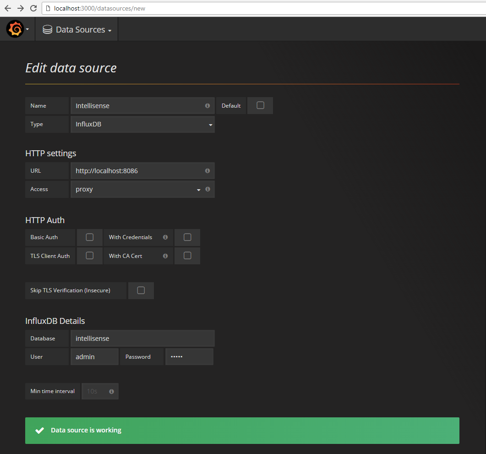
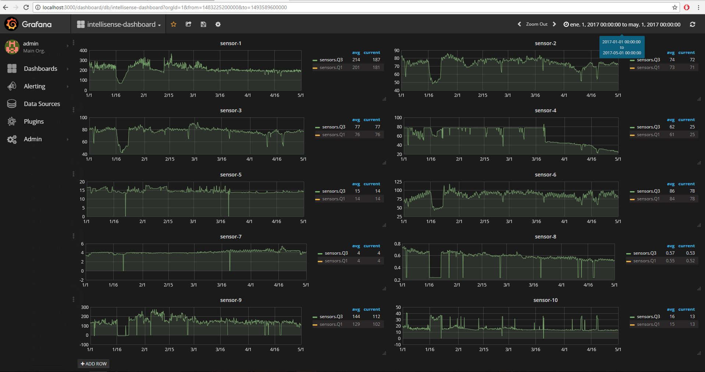

Stream processing pipeline which can test for anomalous data in real-time.

## Requirements
This pipeline is based on Apache Flink and relies on the following technologies:

* Java 1.8
* Maven (bundled with the project)
* Apache Flink (1.4.2)
* Intellij was used as main IDE, therefore the project layout, but this is not mandatory.

In order to sink the results to an Elasticsearch cluster, an instance of Elasticsearch must be active.
The sink has been configured by default assuming that the instance will be a local one running at 
"*localhost:9300*", with cluster name "*elasticsearch*".

* Elasticsearch 5.6.8

Please stay with a 5.x based version of Elastic, since the connector employed by the application is 
accordingly *flink-connector-elasticsearch5*. Other blends have proved to be trouble-makers. 

* kibana-5.6.8

Kibana is **optional** but facilitates creating and managing the indexes via its web-ui.
Please stay with a version according to the one of Elasticsearch.  
Alternatively CURL can always be used via the Elasticsearch REST api.

Visualizing the results in Grafana is **optional** (but nice), in case of willing to use them, an instance of InfluxDB
must be in place. The versions used for development were

* Grafana 4.6.3
* InfluxDB 1.4.2-1

## Running the job

The job can be run by executing the main job class "*MainJob.java*" from within the development environment.
All the configuration of the job lays in the configuration file for the project **application.yml**  

Please take a moment to give it a look so none of the values falls out of place regarding the requirements
what the job is intended to do.

```yaml
### CONFIGURATION VALUES for the sensors-anomaly-detection main job

# Elascticsearch cluster config
job.enableElastic: true
elastic.cluster.address: 127.0.0.1
elastic.cluster.port: 9300
elastic.cluster.name: elasticsearch
elastic.bulk.flush.max.actions: 1

# Grafana visualizations are not enabled by default, but if it is wanted, InfluxDB must be in place too
job.enableGrafana: false

# Flink windowing configuration
flink.window.elements: 100
flink.window.slide: 1

# Default values to connect to InfluxDB
influxdb.url: http://localhost:8086
influxdb.username: admin
influxdb.password: admin
influxdb.dbname: intellisense
```  


The job can also be deployed as a packaged JAR in a Flink cluster. In order to generate the packaged JAR the maven
"*package*" goal must be invoked.
This will bundle the job in a fat-jar. Please not, that in order to use this deployment method, a small tweaking in the
file paths of both the config file, and the sample file, needs to be done in the main job class, since the "*shade*"
maven plugin will flatten all the projects folder, allocating them in the root of the JAR bundle.

## Logs

Logs of the application are provided via Logback. A file appender is in place writing errors to the "*/logs*" folder.
Some operators are fail prompt, for instance, the mapper from CSV tuples to POJO classes, in the cases where
the value is missing or malformed. Such errors can be consulted in the log.

## Visualizations with Grafana

Visualizations of all the sensors are available via
```yaml
job.enableGrafana: true
```

Installation instructions for Grafana and InfluxDB can be easily followed [here](http://docs.grafana.org/installation/)
and [here](http://docs.influxdata.com/influxdb/v0.9/introduction/installation/).
The default installations settings are the same as the ones used in the configuration of the pipeline.

In order to load the graphs board in Grafana the first thing is select the InfluxDB datasource for this pipeline.

A new datasource can be easily created and saved using the values defined in the main configuration file.



If you have an already running instance, the existing databases can be queried by running the command 
"*SHOW DATABASES*" in the InfluxDB CLI.
The application will automatically create a database named "**intellisense**", please take this into account in case
you already have an existing database of the same name for other purposes.
If you need the database to be cleansed of prior data, it can be done simply by running the 
"*DROP DATABASE dbname*" from the CLI and the application will create again in every run if it is not there.  
  
The application bundles already a Grafana dashboard under the "*/grafana*" folder.  
In this dashboard there are graphs for all the existing sensors and the dates of interest, 
more specifically, showing the values of the 25-percentile (Q1) and the 75-percentile (Q3) of each sensor history.
A lot can be accomplished with Grafana, but this is a good start.



This generated dashboard can be uploaded to Grafana just importing the provided file "*grafana-dashboard.json*" 
at the dashboards, import menu. Is this dialog you can select the file to upload, or copy-paste the JSON contents
for fine tunning


## Setting Elasticsearch

A sample configuration file "*elastic.yml*" to be placed in the cluster "*/config*" folder is provided, 
although this is nothing else than manually specifying the default cluster.name to "elasticsearch".  
Please verify that your cluster is named accordingly to the config var "*elastic.cluster.name*".

The "*create_index_sensor-all.curl*" contains the CURL call in order to create an index of the same shape as
the datapoints class mapping, please create an index before executing the pipeline with an Elastic sink.

Alternatively a JSON as follows can be just pasted on Kibana:

```json
PUT index-all
{
    "settings" : {
        "number_of_shards" : 1
    },
    "mappings" : {
        "sensor" : {
            "properties" : {
                "key" : { "type" : "text" },
                "timestamp" : { "type" : "date" },
                "value" : { "type" : "float" },
                "score" : { "type" : "float" }
            }
        }
    }
}
```


Running the job with Elasticsearch sinking configured should show the cluster ingesting data against the specified 
index


(...it might a while, tho)


